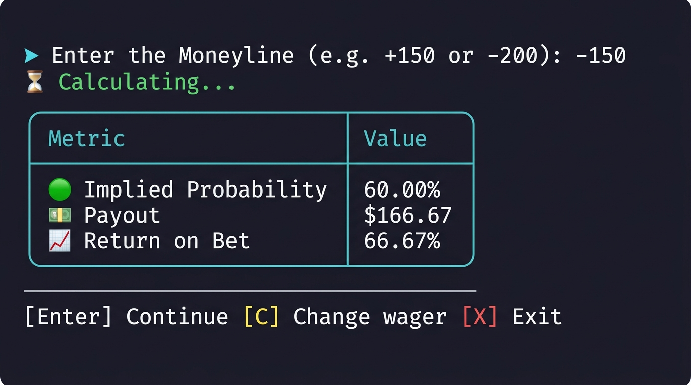

# Betting Odds Converter

[](https://github.com/SanjayShetty01/betting-odds-converter/actions/workflows/rust-test.yml)

A Command Line Interface (CLI) application that converts various types of betting odds into implied probabilities, payouts, and return on bet. Implied probability provides insight into the likelihood of winning as determined by the betting market.

## Table of Contents

- [About](#about)
- [Supported Betting Odds](#supported-betting-odds)
- [Getting Started](#getting-started)
- [Installation](#installation)
- [Usage](#usage)
- [Contributing](#contributing)
- [License](#license)

## About

The Betting Odds Converter allows users to easily convert different types of betting odds into implied probabilities. It provides valuable insights for bettors, helping them make informed decisions based on market odds.

## Supported Betting Odds

The application supports three widely used types of betting odds:

1. **American Moneyline:**
   - Denoted by an integer number.
   - A positive American Moneyline indicates the potential profit when wagering $100.
   - A negative American Moneyline indicates the amount needed to wager to win $100.

2. **Decimals:**
   - Decimal odds quote the potential returns that would be paid if the bet succeeds in your favor.

3. **Fractions:**
   - Fractional odds quote the potential returns if the bet succeeds.
   - Presented in a fractional format (e.g., 3/4).

## Getting Started

To get started with the Betting Odds Calculator, you'll need to install it on your local machine.

## Installation

### From .exe (for Windows)
1. Download the `.exe` from the [releases page](https://github.com/SanjayShetty01/betting-odds-converter/releases).

### From .deb (for Debian/Ubuntu-based systems)
1. Download the `.deb` package from the [releases page](https://github.com/SanjayShetty01/betting-odds-converter/releases).
2. Open a terminal and run:
   ```bash
   sudo dpkg -i betting-odds-converter_3.1.0-1_amd64.deb 
   ```
3. Install any missing dependencies:
   ```bash
   sudo apt-get install -f
   ```

### From .rpm (for Fedora/Red Hat-based systems)
1. Download the `.rpm` package from the [releases page](https://github.com/SanjayShetty01/betting-odds-converter/releases).
2. Open a terminal and run:
   ```bash
   sudo rpm -i betting_odds_converter-3.1.0-1.x86_64.rpm 
   ```

### From Source
1. Clone the repository:
   ```bash
   git clone https://github.com/SanjayShetty01/betting-odds-converter.git
   cd betting-odds-converter
   ```
2. Build the project:
   ```bash
   cargo build --release
   ```
3. The compiled binary will be available in the `target/release/` directory. Run it:
   ```bash
   ./target/release/implied
   ```

## Usage

#### Screenshot


1. **Enter Wager:**
   - Specify your bet amount or press Enter to keep the default ($100).

2. **Select Betting Odds Type:**
   - Choose the type of betting odds you want to convert (American Moneyline, Decimals, or Fractions).

3. **Enter Odds Value:**
   - Input the odds value associated with your bet.

4. **Implied Probability & Metrics:**
   - The application will calculate and display the implied probability, payout, and return percentage in a formatted table.

5. **Repeat as Needed:**
   - Convert additional odds, update the wager, or exit using the prompt options.

## Contributing

Contributions to this project are welcome. Feel free to open issues or submit pull requests to enhance the functionality or fix any bugs.

## License

This project is licensed under the MIT License.
